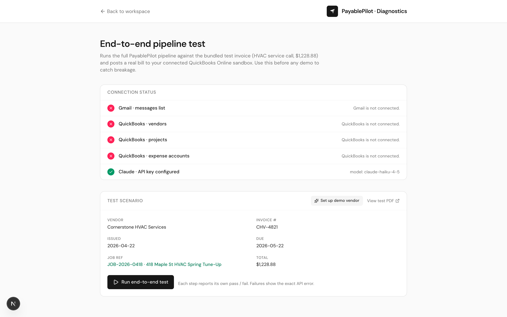

# PayablePilot · Flows Reference

This is the complete walkthrough of every meaningful screen and what flow it serves. Updated for Wednesday's demo.

## Big picture — what PayablePilot is

A copilot for SMB bookkeepers (initial design partner: an HVAC client doing ~80 invoices/month, currently using QuickBooks Online + Dext). It does five things end-to-end:

1. **Ingests** invoices from a connected Gmail mailbox (15-second polling; soon Pub/Sub push) or via manual PDF upload.
2. **Extracts** vendor, dates, amounts, line items, and project / job references using Claude vision — streamed live so fields populate field-by-field while the model is still generating.
3. **Auto-codes** every captured invoice: fuzzy-matches the QBO vendor, fuzzy-matches a QBO project from the extracted job ref, and picks an expense account using keyword heuristics. Each picker tracks whether the agent or a human filled it.
4. **Detects duplicates** before the bookkeeper can post. As soon as the agent has a vendor + invoice number, it queries QuickBooks for an existing Bill on the same `(VendorRef, DocNumber)` pair. Matches are flagged red, expansion explains it, and the Post button is hard-disabled.
5. **Posts** the bill into QuickBooks Online for the bookkeeper's release. The bookkeeper can review, override any picker, then click Post — or in fully-automatic mode, the agent posts on its own. **Payments themselves are never initiated by PayablePilot** — the bookkeeper releases payment from inside QuickBooks.
6. **Stays out of your way the rest of the time.** Everything else (chat, agent outbox, reports, compliance, statement reconciliation) shows up in the guided `/demo` route — that surface still exists, but the lean `/app` is what real users live in.

## Two surfaces, one codebase

- **`/app`** — the real product. No mocked data. Every view is driven by the user's connected Gmail and QuickBooks Online accounts. Lean sidebar: Dashboard / Inbox / Bills to post / Vendors / Projects.
- **`/demo`** — the polished narrative tour using a fictional property-management portfolio (Greenfield PM, Erin Boyd, Summit Plumbing, etc.). Used for sales pitches; doesn't reflect what a real user sees once they sign in.

Supporting routes:

- **`/`** — public landing page.
- **`/settings`** — connect Gmail, connect QuickBooks Online, choose workflow style (Strict / Standard / Bills only), configure automation toggles.
- **`/mail`** — vendor-side Gmail simulator used inside the guided demo.
- **`/app/diagnostics`** — internal pipeline test harness (described below).
- **`/tour`** — demo entry point; routes into `/demo`.

---

## 01 — Landing page


**Route:** `/`

Marketing surface. Hero pitch ("AP under control. Without adding headcount."), Loom embed, integrations strip mentioning **only QuickBooks Online and Xero**, features grid, Calendly CTA pointing at `https://calendly.com/mofekayode/15min`. "Drive the live product" CTA links to `/demo` for the guided narrative.

---

## 02 — Workspace dashboard (Day 1)


**Route:** `/app` (default view: Dashboard)

The entry screen for a real user. Probes Gmail and QuickBooks connection state on mount and prompts to finish setup. When both are connected, the headline switches to "You're connected. Let's process some bills." Stat cards (Extracted today / Bills ready to post / Posted to QuickBooks / Errors) populate from the localStorage-backed captured store. Action cards link into Inbox / Bills / Projects and disable themselves when the relevant integration isn't connected.

Topbar carries Gmail + QuickBooks connection pills (green/checked or amber/alert) and a settings gear. Sidebar shows live counts: number of extracted but un-reviewed invoices, number of bills ready to post.

---

## 03 — Live Inbox


**Route:** `/app` → sidebar **Inbox**

The heart of the product. Three things happen here:

1. **Live Gmail polling.** The view fetches `GET /api/integrations/gmail/messages?days=30&max=25` on mount and re-polls every 3 seconds in the background while the inbox is open. Polls are silent — they don't flash the screen empty, and the message list only re-renders if message IDs actually change. So a forwarded email shows up within ~3 seconds without the user touching anything.
2. **Server-side filter for invoices only.** The Gmail query is `has:attachment newer_than:30d (invoice OR receipt OR bill OR statement OR "amount due" OR "payment due" OR "order confirmation") -filename:ics -category:promotions`. This skips USPS Informed Delivery, calendar invites, and promotional senders. We're not surfacing every email — only the AP-relevant ones.
3. **Streamed extraction.** Click any PDF attachment's **Extract** button. The endpoint streams Claude's response as Server-Sent Events. The "Extracted by Claude" branding is gone — instead, fields populate field-by-field with shimmer placeholders for empties, capped by a small "Reading invoice…" badge with elapsed time. Vendor name appears at ~1s, totals at ~3s, line items as they emerge. Total wall time is ~5-6s but **perceived latency is sub-second** because the user sees real progress the entire time.

After extraction, the **Send to bills** button persists the captured invoice into the localStorage store and auto-navigates to the Bills queue.

The header also has a compact **Upload** button → drag-and-drop modal that uploads any PDF directly to Claude (`POST /api/extract/stream` with `source: "upload"`) and lands the result in the same captured-invoice store.

Disconnected state (shown in the screenshot): friendly empty state with a link to `/settings`. No fake messages.

---

## 04 — Bills to post (the auto-coded review surface)


**Route:** `/app` → sidebar **Bills to post**

This is where the copilot pitch becomes real. When a captured invoice lands here, the page automatically:

- **Fuzzy-matches the extracted vendor name** against the QBO vendor list. Cornerstone HVAC Services on the test invoice → finds it in QBO and auto-assigns. Visible signal: the vendor picker shows an **"Auto"** pill in brand color and has a brand-tinted border instead of the amber "required" border.
- **Fuzzy-matches the extracted project_ref** against the QBO project list. Token overlap match — the extracted "Job #JOB-2026-0418 · 418 Maple St HVAC Spring Tune-Up" lines up with a QBO project named "418 Maple HVAC" because the meaningful tokens overlap. Same "Auto" pill on the picker.
- **Picks an expense account** using keyword heuristics. "HVAC", "tune-up", "filter", "labor", "repair" → prefers QBO accounts named "Repairs & Maintenance". "Supplies", "materials" → "Supplies". And so on, with a fallback to the first available expense account so every row is always postable. Same "Auto" pill.

When all three pickers are auto-filled, the row header gets a small **Auto-coded** badge in brand color next to the vendor/invoice number — that's the visual signal that the agent did the work.

**Duplicate detection.** As soon as a row has both a QBO vendor and an invoice number, the page silently hits `GET /api/integrations/qbo/bills/check?vendorId=…&docNumber=…` which runs `select * from Bill where VendorRef = '…' and DocNumber = '…'` against QBO. If a match comes back, the row's auto-coded badge is replaced with a red **Duplicate** pill, the expanded view shows a banner naming the existing bill ID, and the Post button is hard-disabled. The bookkeeper can either remove the row or change the invoice number if it really is a different bill that happens to share a number.

**The "Upload invoice" button lives directly on this page** (top-right of the section header) so the user can drop an invoice without leaving the bills queue.

**Manual override** is still one click — open any picker, search, pick something else. The picker switches its source from "auto" to "manual" and the Auto-coded badge disappears.

**Posting flow:**
1. User clicks **Post bill to QuickBooks**.
2. Frontend calls `POST /api/integrations/qbo/bills` with `{ vendorId, txnDate, docNumber, projectId, lines: [{ description, amount, accountId }] }`.
3. The backend hits `POST /v3/company/{realmId}/bill?minorversion=70`. Each line carries `AccountBasedExpenseLineDetail.AccountRef` and (when present) `CustomerRef` for project costing.
4. On success the row flips to **Posted**, the QBO bill ID is stored, and the row drops into the "Posted to QuickBooks" section at the bottom.
5. On failure the row flips to **Error** with the literal Intuit error inline.

The empty state (shown) has a one-click **Open inbox** CTA.

---

## 05 — Vendors (QuickBooks live)


**Route:** `/app` → sidebar **Vendors**

Browse the vendor list pulled live from QuickBooks. `select * from Vendor maxresults 25`. Each row shows display name, primary email + phone, 1099 flag, open balance. The search box filters client-side. Disconnected state: friendly amber prompt to connect QuickBooks via Settings.

Used for sanity-checking what data the agent has to work with, and to verify a newly-created vendor appears (e.g., after running "Set up demo vendor" in `/app/diagnostics`).

---

## 06 — Projects (QuickBooks live)


**Route:** `/app` → sidebar **Projects**

QBO Projects list. `select Id, DisplayName, ParentRef, Active from Customer where IsProject = true and Active = true`. The endpoint also gracefully handles the case where the QBO sandbox doesn't have Projects feature enabled — it returns `[]` instead of erroring, and the page shows a clear empty state with the exact path to enable Projects (Settings → Account and Settings → Advanced → Projects).

The data shown here is the same data the project picker on the Bills queue draws from for auto-matching.

---

## 07 — Settings


**Route:** `/settings`

Three sections, top to bottom:

1. **Integrations** — Gmail and QuickBooks Online cards with **Connect** buttons. Each shows the required env vars and a link to the developer console. Real OAuth flows; tokens persist in HTTP-only cookies for the demo (production swap target: a database keyed by user/workspace).
2. **Workflow style** — three-card picker:
   - **Strict** — POs required, full 3-way match. For property managers, formal procurement.
   - **Standard** *(default)* — POs optional, match if a PO exists otherwise post directly. Best fit for most SMBs.
   - **Bills only** — no matching at all. Captured invoices flow straight to "ready to post". Best for HVAC / contractors / service businesses without formal procurement.
3. **Automation toggles** — grouped:
   - *When invoices arrive*: extract fields, match POs, block duplicates (default on).
   - *When something needs follow-up*: auto-reply on discrepancies (default off — agent drafts but waits), chase receipts, chase W-9s, overdue reminders, statement reconciliation.
   - *When ready to post*: auto-post matched bills (default off, flagged "Skips your approval").
   - *Notifications*: daily digest with time picker, discrepancy pings.

Settings persist in localStorage; "Reset to defaults" button clears overrides.

---

## 08 — Diagnostics (internal demo prep tool)



**Route:** `/app/diagnostics`

Internal tool for verifying the full pipeline before a demo. Two sections:

1. **Connection status probe** — checks Gmail, QBO Vendors, QBO Projects, QBO Accounts, Claude API key configuration. Each row shows green/red plus the live count (e.g., "25 vendors", "44 expense accounts", "0 — Projects feature off in this sandbox").

2. **End-to-end test scenario** — runs the bundled HVAC test invoice (Cornerstone HVAC Services CHV-4821, $1,228.88, with `Job #JOB-2026-0418` on every line item) through the full pipeline:
   1. Fetch test PDF (~15 ms).
   2. Send to Claude → extract (~5-7 s on Haiku 4.5).
   3. List QBO vendors / accounts / projects.
   4. Post a bill to QBO sandbox using the first available vendor + first expense account + first project.
   5. Surface the QBO bill ID with a deep link to https://sandbox.qbo.intuit.com/app/bills.

Each step times itself and shows the actual API error inline if anything fails — so a sandbox-specific schema rejection or a stale token can be diagnosed in seconds.

A **"Set up demo vendor"** button next to the test scenario one-click-creates `Cornerstone HVAC Services` as a vendor in your QBO sandbox via `POST /api/demo/setup` (which calls `createVendor` on Intuit's API). Once that vendor exists, the auto-coding on the Bills queue matches the test invoice perfectly without manual picking — perfect for the "watch the agent work autonomously" demo.

---

## 09 — Guided demo (Greenfield PM narrative)


**Route:** `/demo`

Polished sales-pitch surface using the Greenfield Property Management portfolio. Sidebar groups: Overview (Daily digest, Agent outbox), Inbox & queue (Inbox, Captured queue, Discrepancies, Bills to post), Reports (AP aging, Vendor statements, Month-end close), Compliance (W-9 / 1099, Expense reports, Card reconciliation, Vendors).

Why we keep this: the narrative around Greenfield is what makes the agent's *vision* easy to grasp in a 15-minute call. It also showcases features the lean `/app` doesn't have yet (chat agent, AP aging, statement reconciliation, etc.) — those graduate from `/demo` to `/app` once paying users have real data backing them.

---

## 10 — Vendor mail simulator


**Route:** `/mail`

Part of the guided demo. A fake Gmail UI with three accounts in the top-right switcher: Summit Plumbing Billing (vendor) drafts an invoice and sends → triggers the demo cascade in `/demo`. Reliable Landscaping (vendor with $160 pricing discrepancy). Erin Boyd · Greenfield PM (the bookkeeper's view of the agent's morning digest, discrepancy alerts, etc.). AP Inbox · Greenfield PM (catch-all `ap@greenfieldpm.com` showing what a property manager actually receives — invoice noise to underscore the volume problem).

This route is purely scripted. It's narrative theatre.

---

## End-to-end demo arc (Wednesday plan)

**The "automatic" version** — the copilot story:

1. **`/demo`** — quick narrative tour to anchor the vision: morning digest → flagged discrepancy → clean batch posting. (3 min)
2. **`/settings`** — both integrations connected. Workflow style set to **Bills only** since the HVAC client doesn't run POs. (1 min)
3. **`/app/diagnostics`** — click **"Set up demo vendor"** before the call to seed Cornerstone HVAC Services in the QBO sandbox. (30 s, do this *before* the call)
4. **Forward the test invoice** from `mofekayode@gmail.com` to itself with subject "Cornerstone HVAC test invoice". (15 s)
5. **`/app` → Inbox** — within ~3s the email appears at the top via polling. Click it. (live)
6. **Click Extract** — fields stream in: vendor at ~1s, totals at ~3s, line items live. **Send to bills.** (5-7 s)
7. **Bills queue** — the row appears already coded with **Auto** pills on every picker and the **Auto-coded** badge in the row header. Vendor: Cornerstone HVAC Services (auto). Project: matched to a QBO project if you've got one (auto). Expense account: Repairs & Maintenance (auto). One click: **Post bill to QuickBooks**. (5 s)
8. **Open https://sandbox.qbo.intuit.com/app/bills** — the bill is there with the right vendor, account, and project. (live)

**The "manual override" version** — if Wyatt wants to see human-in-the-loop:

Same flow, but on step 7 click any picker and override. The Auto-coded badge disappears, the picker source flips to "manual". Click Post.

**The "manual upload" version** — for invoices that don't come through email:

On either Inbox or Bills view, click **Upload invoice**. Drag any PDF. Goes through the same streaming extraction → bills queue → post pipeline.

---

## What's mocked vs. real

| Layer | State |
| --- | --- |
| Landing page | Static marketing copy |
| `/demo/*` | Fully mocked Greenfield narrative (intentional) |
| `/mail` | Scripted vendor-to-Erin email cascade (intentional) |
| OAuth (Gmail + QBO) | **Real** — production Google + Intuit consent screens |
| Gmail message list + 3-second polling | **Real** — `gmail.users.messages.list` |
| Gmail attachment download | **Real** — `gmail.users.messages.attachments.get` |
| PDF extraction (streamed) | **Real** — Claude Haiku 4.5 vision via Anthropic SDK, Server-Sent Events |
| QBO Vendors / Projects / Accounts | **Real** — QBO REST `/v3/.../query` |
| Posting bills to QBO | **Real** — QBO REST `POST /v3/.../bill` |
| Duplicate detection before posting | **Real** — QBO REST `select * from Bill where VendorRef = ? and DocNumber = ?`, posting hard-disabled on hit |
| Auto-coding (vendor / project / account) | Heuristic: vendor + project use fuzzy matching, account uses keyword rules with sensible fallback |
| Captured-invoice persistence | localStorage (production swap target: Postgres) |
| Token storage | HTTP-only cookies (production swap target: encrypted DB rows) |
| User accounts / multi-tenancy | Single-browser-session for now |
| Background sync / push | None — frontend polls every 3 s while Inbox is open |

---

## Known gaps to close after Wednesday

- **Forwarding-email intake** (`ap+client123@payablepilot.com`) — Wyatt asked for it. Postmark inbound parse to a webhook is half a day.
- **Background Gmail sync via Pub/Sub push** instead of client polling — needs GCP Pub/Sub + per-mailbox `users.watch()`. ~1 day.
- **Multi-tenant data model** — workspaces per client, multiple Gmail mailboxes per workspace, encrypted token storage. ~3 days once a paying customer materializes.
- **Confidence indicators on the extraction card** — flag low-confidence fields so the human knows what to verify.
- **Smarter expense-account suggestion** — the keyword ruleset works; LLM-suggested could do better with vendor history.
- **Chat agent inside `/app`** — currently lives in `/demo`. Spec pending.

---

## Re-running the screenshots

```bash
cd AccountPayableAgent/demo
npm run dev    # in another terminal
node scripts/capture-screenshots.mjs
```

Output lands in `docs/screenshots/`. Captures unauthenticated state by default; sign in to localhost:4380 from the same browser (or comment out the `headless: "new"` line in the script and use a logged-in profile) if you want to capture connected screens too.

---

## Re-running the autonomous Claude extraction test

```bash
cd AccountPayableAgent/demo
node scripts/test-extraction.mjs
```

Loads `.env.local`, sends `public/test-invoice-hvac.pdf` to Claude with the same prompt the production endpoint uses, asserts every important field. Last run: 5.98s, 10/10 assertions passed on Haiku 4.5.
